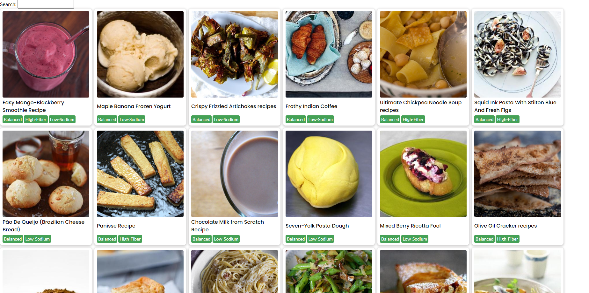

# cookbook

## Overview
This project is part of a course I'm taking in my last year of college where I have been tasked with planning and creating some type of application.

During the planning phase, I landed on developing a digital cookbook so-to-speak; a place to find and save recipies.

The app uses the Edamam API to retrieve data for recipies and nutritional information.

